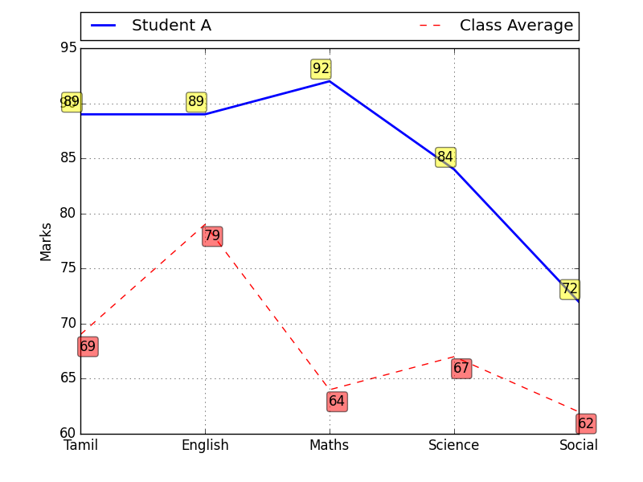

# Student Score Graph

Student Subject Marks as Line Graph

A Python script to generate graphs of student marks comparing with the class avarage

## How to use the script

Create a csv file like the one in `sample.csv`. Ensure that the first row is "Average". Run the script

```
python student_graph.py <file.csv>
```

## Output

A seperate graph is generated for each student like this


